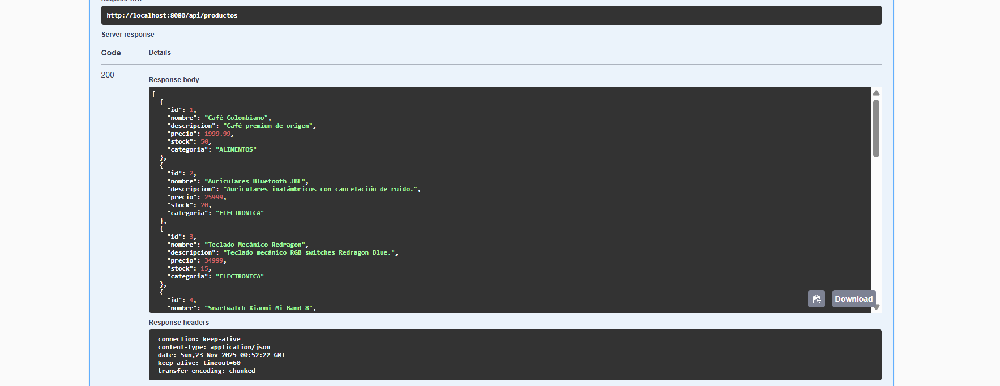
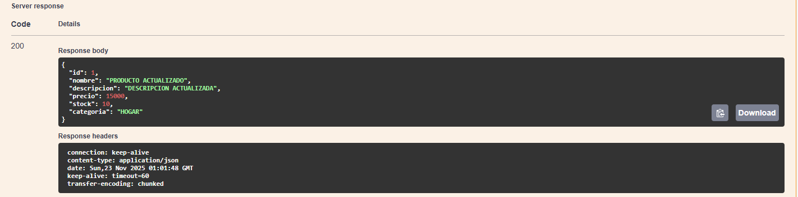
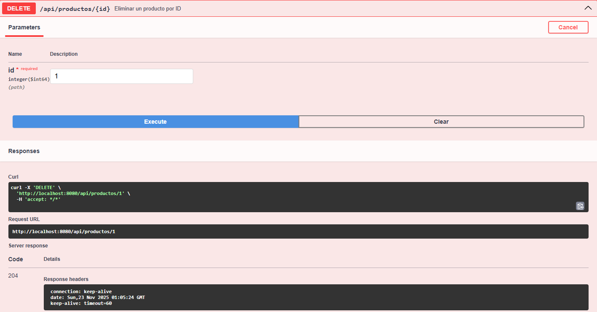
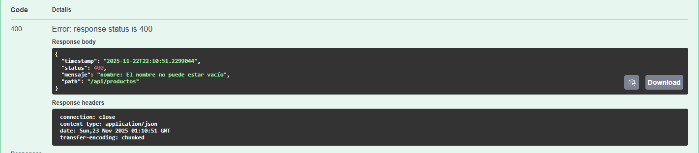

# 🛒 API de Productos – Spring Boot (UTN)

Trabajo Práctico para la cátedra **Programación 3** – Tecnicatura Universitaria en Programación (UTN).  
Este proyecto implementa una API REST completa para gestionar productos con CRUD, validaciones, manejo global de excepciones, documentación OpenAPI/Swagger y persistencia con H2 Database.

---

# ⚙️ Tecnologías utilizadas

- **Java 17**
- **Spring Boot 3.5.7**
- **Spring Web**
- **Spring Data JPA (Hibernate)**
- **Spring Validation**
- **H2 Database**
- **Lombok**
- **Swagger / Springdoc OpenAPI 2.8.9**
- **Maven**

---

# 🚀 Instalación y ejecución

Clonar el repositorio:

```bash
  git clone https://github.com/TU-USUARIO/productos-api-springboot.git
  cd productos-api-springboot

```
## 🌐 Swagger – Documentación de la API

Swagger UI:  
👉 **http://localhost:8080/swagger-ui/index.html**


---

## 🗄️ Consola de Base de Datos H2

Acceso:  
👉 **http://localhost:8080/h2-console**

**Configuración de conexión:**

| Propiedad | Valor |
|----------|-------|
| JDBC URL | `jdbc:h2:mem:testdb` |
| Usuario | `sa` |
| Contraseña | *(vacío)* |


---

## 📚 Endpoints de la API

| Método | Endpoint | Descripción |
|--------|----------|-------------|
| **GET** | `/api/productos` | Listar todos los productos |
| **GET** | `/api/productos/{id}` | Obtener producto por ID |
| **GET** | `/api/productos/categoria/{categoria}` | Listar productos por categoría |
| **POST** | `/api/productos` | Crear un producto nuevo |
| **PUT** | `/api/productos/{id}` | Actualizar producto completo |
| **PATCH** | `/api/productos/{id}/stock` | Actualizar solo el stock |
| **DELETE** | `/api/productos/{id}` | Eliminar un producto |

---

## 🧪 Pruebas realizadas (con capturas)

✔️ **POST – Crear producto (exitoso)**  
✔️ **POST – Error 400 (validaciones)**  
✔️ **GET – Listado completo**  
✔️ **GET – Filtrar por categoría**  
✔️ **GET – Error 404 producto inexistente**  
✔️ **PUT – Actualización completa**  
✔️ **PATCH – Actualizar stock**  
✔️ **DELETE – Eliminación (204)**  
✔️ **H2 – Datos persistidos**

**POST (Crear un producto)**


**GET (Listar productos)**



**GET (Filtrar por categoría)**


**PUT (Actualizacion completa)**



**PATCH (Actualizacion stock de 20 a 0)**


**DELETE (Eliminacion 204)**



**GET (Error 404 producto inexistente)**


**POST (Error 400 validaciones)**



**H2 (Datos persistidos)**


---

## 🔗 Accesos rápidos

| Recurso | URL |
|--------|-----|
| **Swagger UI** | http://localhost:8080/swagger-ui/index.html |
| **API Docs JSON** | http://localhost:8080/v3/api-docs |
| **Consola H2** | http://localhost:8080/h2-console |

---

## 💭 Conclusiones personales

En este trabajo aprendí a:

- Construir una API REST profesional con Spring Boot
- Aplicar validaciones con Spring Validation
- Implementar DTOs para separar capas
- Manejar excepciones globales con `@ControllerAdvice`
- Documentar endpoints con Swagger/OpenAPI
- Usar H2 como base embebida para pruebas
- Organizar un proyecto con buenas prácticas de arquitectura
- Preparar un README profesional con capturas reales

Este proyecto me permitió comprender cómo se estructura un backend real y cómo se documenta para uso profesional.

---

## 👤 Autor

**Nombre:** Uriel Rojas  
**Legajo:** 52748  
